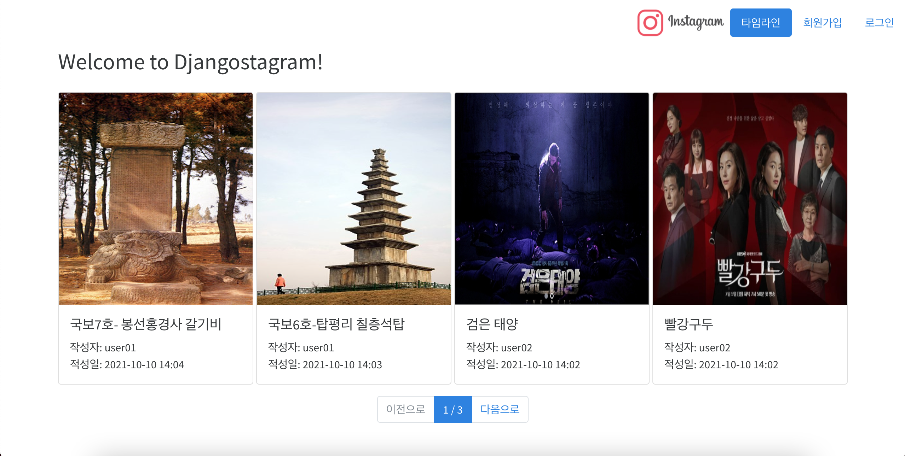
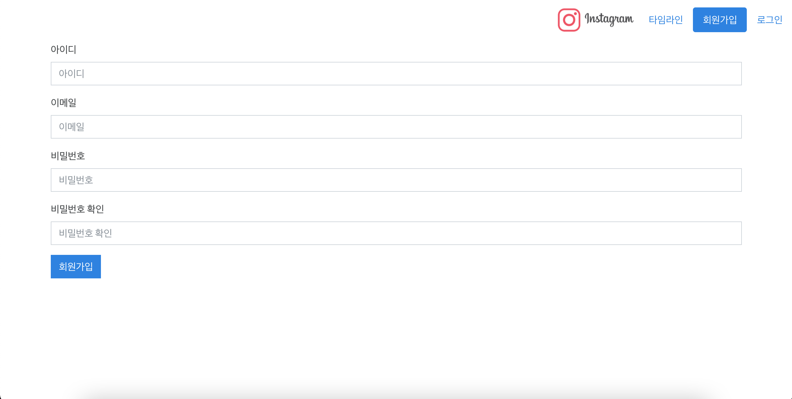
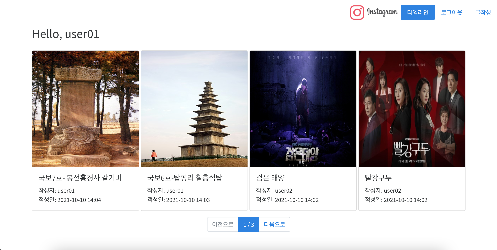
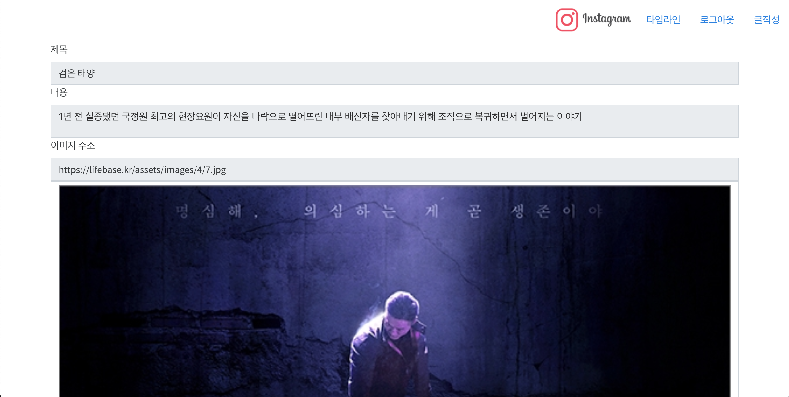
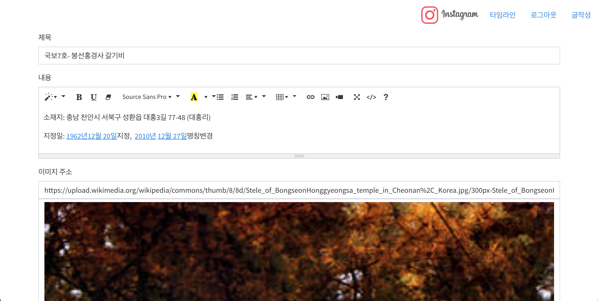
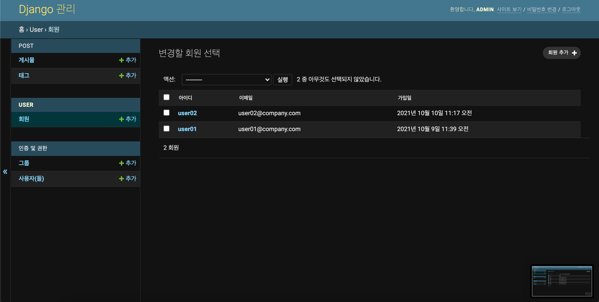
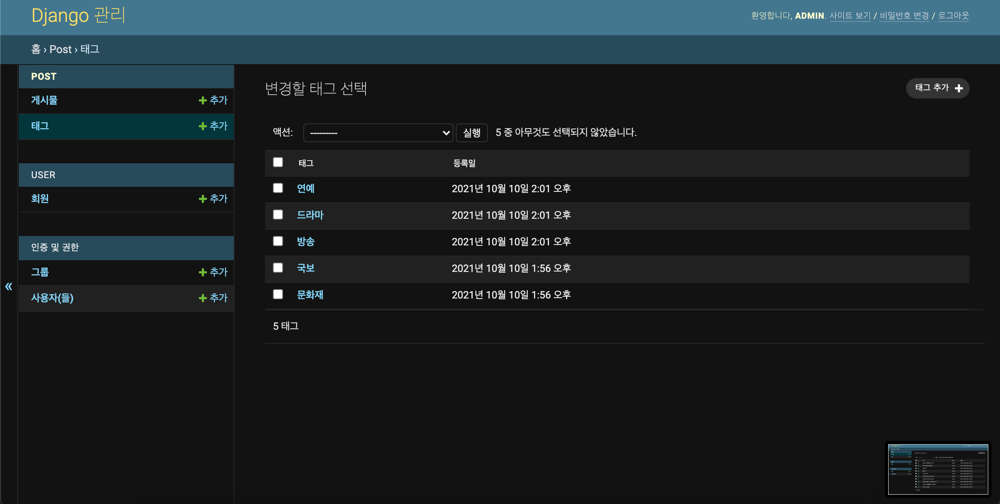
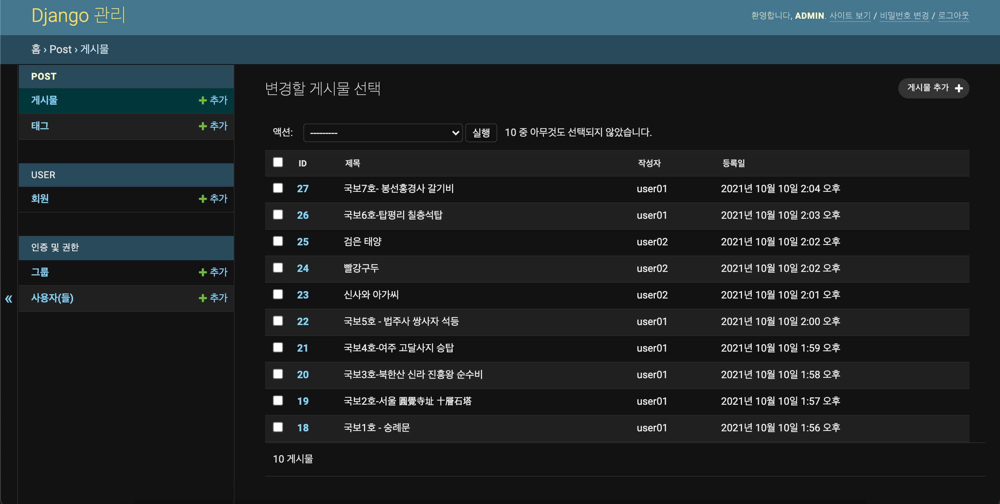

# djangostagram-work
* CodingChallenge Final Mini Project
* 바이트디그리_Final_Django를 사용한 장고스타그램 프로젝트) 참조
## 프로젝트 생성
* djangostagram 프로젝트 생성
* app 이름 규칙의 통일을 위하여 아래와 같이 생성
```
python3 -m venv ./.venv
pip install django
django-admin startproject admin
mv ./admin ./djangostagram
```
## 사용자 관리, 회원가입 및 로그인
* 사용자 관리를 위한 app 생성
* models.py 에 DSUser 클래스 생성
* forms.py 에 RegisterForm(회원가입)과 LoginForm(로그인) 생성
* views.py 에 RegisterUser 와 LoginUser 클래스를 FormView 를 상속받아 구성
* base.html 파일을 extends 하여 아래의 파일 구성
1. timeline.html : 홈 화면
2. register_user.html : 회원 등록
3. login_user.html : 로그인

```
cd ./djangostagram
django-admin startapp user
```
## 공통템플릿 및 Static 구성
* user app 의 templates 디렉터리를 생성
* base.html 파일을 생성하고 Bootstrap 최신 CDN 버전을 추가
* JavaScript 를 통한 상단 메뉴 활성화 여부 변경을 위하여 jQuery CDN 추가
* title 태그 및 summernote 등을 위한 header block 추가
* /static 디렉터리를 추가하고 필요 파일을 배치
1. bootstrap.min.css : Bootswatch Theme
2. my.min.css : Timeline 페이지에서 게시물 선택 시 Highlight 를 위한 CSS
3. work-logo.png : 사이트 로고 이미지
```
<head>
    <!-- Bootstrap CSS -->
    ...
    <!-- Bootstrap JavaScript -->
    ...
    <!-- jQuery JavaScript -->
    <script src="https://code.jquery.com/jquery-3.5.1.min.js"></script>
    <!-- Custom Header -->
    
    
</head>
<body>
<div class="row">
    <ul class="nav nav-pills">
        ...
    </ul>
    </div>
    <!-- Custom Content -->
    <div class="container">
        
        
    </div>
</body>
```



## 포스트 및 태그
* 포스트 및 태그 관리를 위한 app 생성
* models.py 에 Tag 와 Post 클래스 생성
* forms.py 에 PostForm(글쓰기) 생성
* views.py 에 UploadPost(FormView), ViewPost(DetailView) 클래스를 구성
* base.html 파일을 extends 하여 아래의 파일 구성
1. upload_post.html : 글 쓰기
2. view_post.html : 글 보기

```
cd ./djangostagram
django-admin startapp post
```
## 기능 개선
* 작성자의 경우 게시물을 수정, 작성자가 아닌 경우 보기만 가능하도록 수정
* post.views.ViewPost 클래스를 FormView, DetailView 를 상속받아 구현
```
class ViewPost(FormView, DetailView):
    model = Post
    form_class = PostForm
    template_name = 'view_post.html'
    context_object_name = 'post'
    success_url = '/'

    def get_context_data(self, **kwargs):
        ...

    def post(self, request, *args, **kwargs):
        ...
    
    def get_queryset(self):
        ...
    
    def form_valid(self, form):
        ...
```
* view_post.html 파일에서 아래와 같이 분기 처리
```

    <form action="/post/{{ post.id }}" method="post">
        ... 작성자의 경우 수정 처리
    </form>

    ... 작성자가 아닐 때 readonly 처리
{$ endifequal %}
```


## Admin 기능
* 회원 관리

* 태그 관리

* 게시물 관리

* urls.py 구성
```
urlpatterns = [
    path('admin/', admin.site.urls),
    path('', Timeline.as_view()),
    path('user/register/', RegisterUser.as_view()),
    path('user/login/', LoginUser.as_view()),
    path('user/logout/', logout),
    path('upload/', UploadPost.as_view()),
    path('post/<int:pk>', ViewPost.as_view()),
]
```